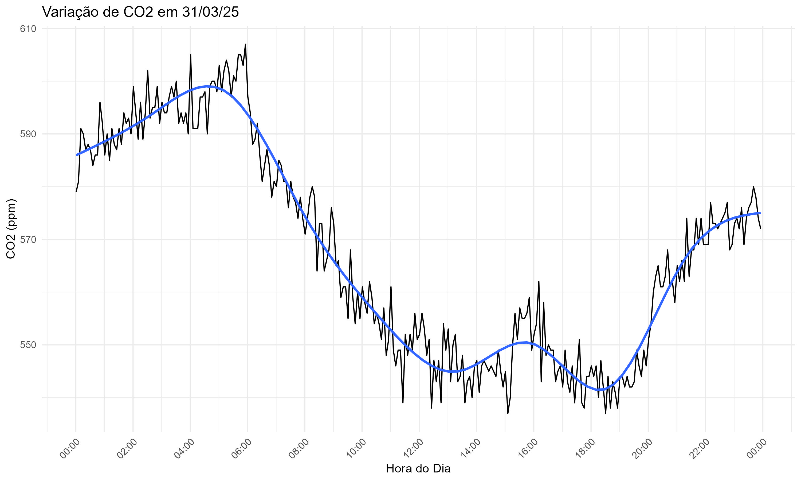
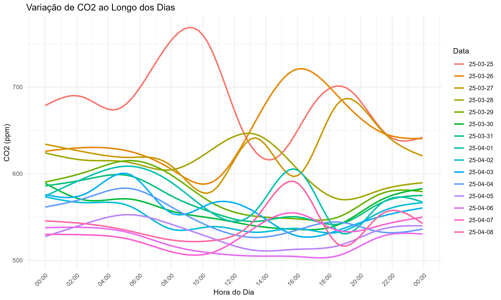
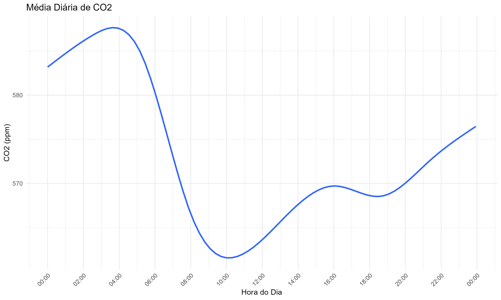

# 🌿📈 Visualização da Variação de CO₂

Este projeto em R tem como objetivo processar, analisar e visualizar a variação dos níveis de CO₂ ao longo do dia, a partir de arquivos contendo registros temporais. Os gráficos gerados ajudam a identificar padrões diários e tendências nos dados de concentração de dióxido de carbono (CO₂).

## 🚀 Funcionalidades

* 📂 **Leitura automática** de todos os arquivos `.txt` dentro da pasta `data/`.
* 🧹 **Organização e limpeza** dos dados com tratamento de datas e horários.
* 📊 **Geração de gráficos diários individuais** para cada data registrada.
* 🔁 **Gráfico comparativo sobreposto** com a variação de CO₂ em diferentes dias.
* 📉 **Gráfico de média diária** com suavização por modelo GAM.
* 💾 **Exportação automática** dos gráficos no formato `.jpg` em alta resolução para a pasta `graficos/`.

## 📦 Pré-requisitos

* **R** instalado
* Pacotes necessários:

```r
install.packages(c("ggplot2", "lubridate"))
```

## 🗂️ Estrutura do Projeto

```
.
├── data/                  # Pasta com arquivos .txt contendo os dados brutos
│   └── exemplo.txt        # Exemplo de arquivo de entrada
├── graficos/              # Saída automática com os gráficos gerados (.jpg)
├── script.R               # Script principal que realiza toda a análise
└── README.md              # Este arquivo
```

## 🧪 Como Usar

1. **Prepare os dados**

   * Crie uma pasta chamada `data/` no diretório do projeto.
   * Coloque dentro dela os arquivos `.txt` contendo colunas como `Data`, `hora` e `CO2`.
   * O separador deve ser vírgula, e os arquivos devem ter cabeçalhos.

2. **Execute o script**

   * Rode o `script.R` no RStudio ou diretamente no console do R.
   * O script irá processar automaticamente todos os arquivos da pasta `data/` e gerar os seguintes gráficos:

     * 📆 Gráficos diários individuais (`YYYY-MM-DD.jpg`)
     * 🧮 Gráfico com todas as datas sobrepostas (`variacao_co2_geral.jpg`)
     * 📊 Gráfico da média diária (`media_diaria_co2.jpg`)

3. **Verifique a saída**

   * Os gráficos são salvos automaticamente na pasta `graficos/`.

## 🖼️ Exemplos de Saída média

### 📆 Gráfico Diário Individual

Cada dia terá um gráfico próprio, como:



### 🔁 Gráfico Sobreposto

Mostra a tendência de CO₂ ao longo do dia para **vários dias ao mesmo tempo**:



### 📉 Gráfico da Média Diária

Representa a média de CO₂ por hora ao longo de todos os dias analisados:

